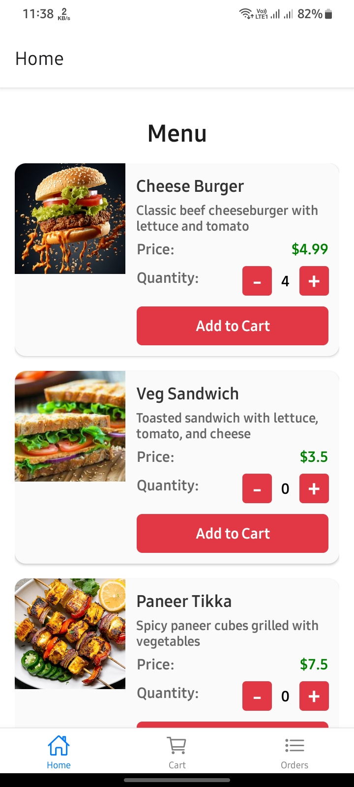
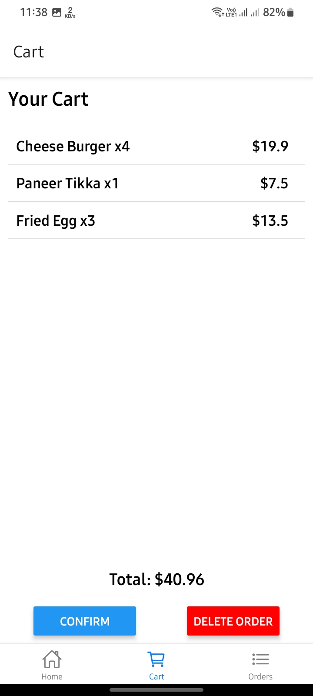
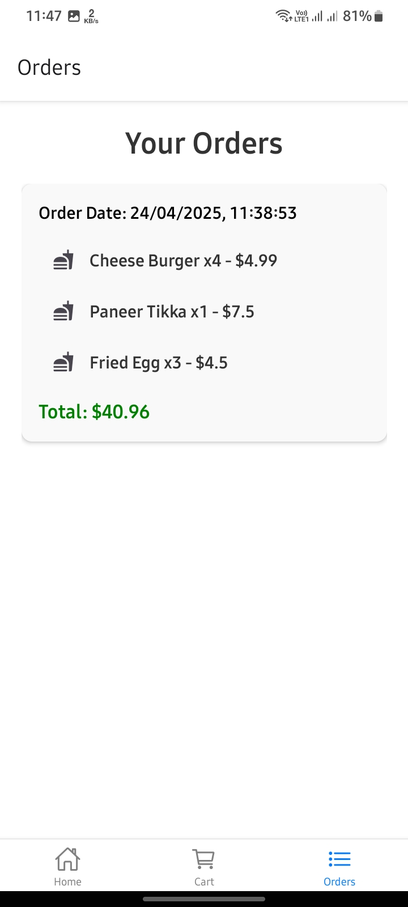

# Mini Food App 🍔

A modern and user-friendly food ordering app built with **React Native** and **Firebase**. The app allows users to browse a menu, add items to their cart, place orders, and view past orders. It supports both **light** and **dark themes** for a seamless user experience.

---

## Features ✨

- **Dynamic Menu**: Fetch menu items from Firebase.
- **Cart Management**: Add, update, and delete items in the cart.
- **Order Summary**: View order details before confirming.
- **Order History**: Track past orders with timestamps.
- **Cross-Platform Support**: Works on Android, iOS, and Web.

---

## Screenshots 📸

| Home Screen | Cart Screen | Orders Screen |
|-------------|-------------|---------------|
|  |  |  |

---

## Tech Stack 🛠️

- **Frontend**: React Native, React Navigation, React Native Paper
- **Backend**: Firebase (Firestore, Authentication)
- **State Management**: Context API
- **Environment Management**: `react-native-dotenv`

---

## Installation 🚀

Follow these steps to set up the project locally:

### Prerequisites
- Node.js (v16 or higher)
- Expo CLI (`npm install -g expo-cli`)

### Steps
1. Clone the repository:
   ```bash
   git clone https://github.com/your-username/mini-food-app.git
   cd mini-food-app
   ```

2. Install dependencies:
   ```bash
   npm install
   ```

3. Create a `.env` file in the root directory and add your Firebase credentials:
   ```env
   FIREBASE_API_KEY=your-api-key
   FIREBASE_AUTH_DOMAIN=your-auth-domain
   FIREBASE_PROJECT_ID=your-project-id
   FIREBASE_STORAGE_BUCKET=your-storage-bucket
   FIREBASE_MESSAGING_SENDER_ID=your-messaging-sender-id
   FIREBASE_APP_ID=your-app-id
   FIREBASE_MEASUREMENT_ID=your-measurement-id
   ```

4. Start the development server:
   ```bash
   npm start
   ```

5. Run the app on your preferred platform:
   - Android: `npm run android`
   - iOS: `npm run ios`
   - Web: `npm run web`

---

## Project Structure 📂

```
mini-food-app/
├── assets/                 # Static assets (images, icons, etc.)
├── context/                # Context API for state management
│   └── CartContext.tsx     # Cart and orders context
├── screens/                # App screens
│   ├── HomeScreen.tsx      # Menu and food items
│   ├── CartScreen.tsx      # Cart management
│   ├── OrderSummaryScreen.tsx # Order summary
│   └── OrdersScreen.tsx    # Past orders
├── services/               # Firebase configuration
│   ├── firebase.ts         # Firebase initialization
│   └── firebaseServer.ts   # Server-side Firebase logic
├── .env                    # Environment variables
├── App.tsx                 # Main app entry point
├── package.json            # Project dependencies and scripts
└── README.md               # Project documentation
```

---

## Firebase Setup 🔥

1. Go to the [Firebase Console](https://console.firebase.google.com/).
2. Create a new project and add a web app.
3. Copy the Firebase configuration and paste it into the `.env` file.
4. Enable Firestore and Authentication in the Firebase Console.

---

## Contributing 🤝

Contributions are welcome! Please follow these steps:

1. Fork the repository.
2. Create a new branch:
   ```bash
   git checkout -b feature/your-feature-name
   ```
3. Commit your changes:
   ```bash
   git commit -m "Add your message here"
   ```
4. Push to the branch:
   ```bash
   git push origin feature/your-feature-name
   ```
5. Open a pull request.

---

## License 📄

This project is licensed under the [MIT License](./LICENSE).

---

## Contact 📧

For any inquiries or feedback, feel free to reach out:

- **Email**: aakashsoni8781@gmail.com
- **GitHub**: [akash2061](https://github.com/akash2061)

---

Enjoy using the **Mini Food App**! 🍕